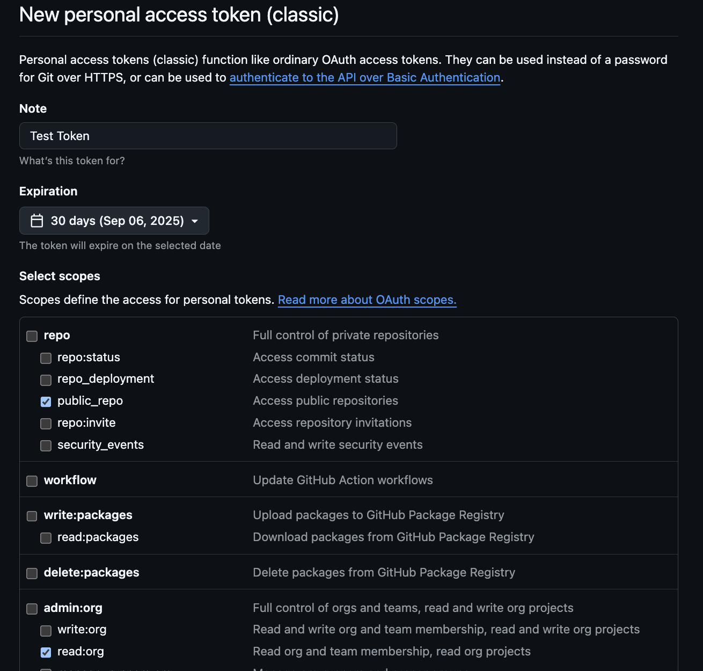

# How to create a GitHub Personal Access Token

GitHub Personal Access Tokens are one way to authenticate your code so you can use the GitHub
API to retrieve information about your team, repo(s), and Pull Requests (PRs). The steps to 
creating them aren't complicated and you can do this in a few minutes time.

## Important Considerations

1. Request only read access. Remember that Voyagers only have read access to public repos in
the `chingu-voyages` GitHub organization. Even if you create a token with update permissions
any attempt to use it to update GitHub will fail.

2. Treat your personal access token as you would any secret, like an API key or password. Don't
expose it to anyone outsie your team and don't hardcode it in your application code.

3. Only one personal access token is required. We suggest that one teammate create it for your
team, but do this in your Kickoff meeting at the start of the Voyage so everyone can see the
process.

## How to create a Personal Access Token

1. Open a browser tab to this URL --> https://github.com/chingu-voyages
2. In the upper right hand corner of the window click on your user icon and select Settings
3. On the Settings page scroll to the bottom and select the Developer Settings option on the left hand part of the screen
4. Click on Personal Access Tokens and select Tokens (classic)
5. Click on the Generation New Token button and select Generate new token (classic)
6. Finally, create a new token with only these two options selected.

You can learn more about authenticating API calls using personal access tokens [here](https://docs.github.com/en/rest/authentication/authenticating-to-the-rest-api?apiVersion=2022-11-28#authenticating-with-a-personal-access-token).