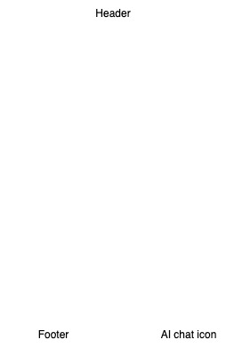

# voyage-project-pr-status
Chingu Voyage Project - GitHub PR Review Status Board

## Table of Contents

* [Team Documents](#team-documents)
* [Our Team](#our-team)
* [Overview](#overview)
* [General Instructions](#general-instructions)
* [Requirements & Specifications](#requirements-and-specifications)
* [Contributing](#contributing)
* [Acknowledgements](#acknowledgements)
* [About Chingu](#about-chingu)

## Team Documents

You may find these helpful as you work together to organize your project.

- [Team Project Ideas](./docs/team_project_ideas.md)
- [Team Decision Log](./docs/team_decision_log.md)

Meeting Agenda templates (located in the `/docs` directory in this repo):

- Meeting - Voyage Kickoff --> ./docs/meeting-voyage_kickoff.docx
- Meeting - App Vision & Feature Planning --> ./docs/meeting-vision_and_feature_planning.docx
- Meeting - Sprint Retrospective, Review, and Planning --> ./docs/meeting-sprint_retrospective_review_and_planning.docx
- Meeting - Sprint Open Topic Session --> ./docs/meeting-sprint_open_topic_session.docx

## Our Team

Everyone on your team should add their name along with a link to their GitHub
& optionally their LinkedIn profiles below. Do this in Sprint #1 to validate
your repo access and to practice PR'ing with your team *before* you start
coding!

- Eoin McDonnell: [GitHub](https://github.com/oldmcdonnell) / [LinkedIn](https://www.linkedin.com/in/mcdonnell-eoin)
- Marissa Lamothe: [GitHub](https://github.com/msrissaxox) / [LinkedIn](https://www.linkedin.com/in/marissalamothe/)
- Spandan Mahat : [GitHub](https://github.com/spandanmahat00) / [LinkedIn](https://linkedin.com/in/spandan-mahat-078662266)

   ...
- Teammate name #n: [GitHub](https://github.com/ghaccountname) / [LinkedIn](https://linkedin.com/in/liaccountname)

## Overview

Welcome, Chingus!

Something all project teams seem to struggle with is getting their GitHub Pull Requests (PRs)
reviewed in a timely manner. Few things hold up team progress more than having changes
queued up waiting on other team members to review them.

Wouldn't it be helpful if teams had a PR status board customized to their team to help them
track not only PR's that are waiting review, but also PR's that have been completed? Yes, 
GitHub provides this, but it is very basic and teams need all the information they can get.

In this voyage, your team will design and build a web application, the _PR Status Board_,
to track current PR's waiting review as well as the history of PR's completed by the team.

Your objective is to create an application that will utilize GitHub's REST API to retrieve
current and historical PR status for the PR's created on your team repos. We'll provide you
with instructions on how to create a read-only API key so you will be able to access this 
information, as well as [sample code](https://github.com/chingu-voyages/voyage-project-pr-status/tree/main/src) to demonstrate how to retrieve this data through GitHub's API.

Since GitHub's API is _rate limited_ the first feature you implement must be to retrieve and
save the data returned so you can replay it to test your app, without having to access it
through the API while you are testing.

The _PR Status Board_ will help you build new _soft skills_ and refine your current role-based skills. It will also let you build new skills and experience using AI - but, more on this
below.

## General Instructions

This project is designed to be worked on by a team rather than an individual
Chingu. This means you and your team will need to thoroughly read and
understand the requirements and specifications below, **_and_** define and
manage your project following the _Agile Methodology_ defined in the
[Voyage Handbook](https://github.com/chingu-voyages/Handbook/blob/main/docs/guides/voyage/voyage.md#voyage-guide).

As you create this project make sure it meets all of the requirements, but once
you've reached your _Minimum Viable Project (MVP)_ state, start implementing the optional 
features or get creative and extend it in ways we haven't envisioned. In other words, use
the power of teamwork to make it distinctive and unique.

Remember, UI/UX creativity is yours to explore—design an interface that stands
out while ensuring ease of use.

Also, there is no need to purchase any subscriptions or software for this project. 

* The [GitHub API](https://docs.github.com/en/rest?apiVersion=2022-11-28) should be used
to access information about your team, repo(s) and PR's. It is free to use, but someone
on your team will need to [create a GitHub personal access token](./client/src/assets/GH_personal_access_token_options.png) in order to use it. 
* The 
[Gemini Flash 1.5 free tier](https://ai.google.dev/pricing#1_5flash) is sufficient for the
AI part of the project and there are many 
[web hosting services](https://github.com/chingu-voyages/Handbook/blob/main/docs/resources/techresources/appdeployment.md) 
with free tiers you can use to deploy your app.

We have added a sample React apps to the `src` directory of this repo so you can
see how to call both of these API's.

## Requirements and Specifications

### What You Need to Do

The following define the minimum requirements and ideas for features you should
implement. But, we've also included stretch goals you should use to enhance
your app once you complete these basic requirements.

#### Structure

* [ ] This can be implemented as a frontend application for Tier 1 & Tier 3. But, Tier 3 teams should implement both a frontend and backend.
* [ ] You may use any languages, tools, or libraries your team agrees on to design and build this app.
* [ ] You may use AI for research. But, you may **_NOT_** use it to create code for your app.

#### Styling

* [ ] Surprise us!!! Use your team's creativity to make this app distinctive.
* [ ] Add a footer containing a link to your team's GitHub repo.
* [ ] Recommend using this resource for [clean CSS](https://israelmitolu.hashnode.dev/writing-cleaner-css-using-bem-methodology).

#### Functionality

* Application Overview

  * [ ] Develop an application to help your team track the status of open Pull Requests in GitHub
  and closed (historical) ones in GitHub
  * [ ] Ensure the application is user-friendly, accessible, and visually appealing.
  * Each page should contain these components:
    * [ ] A _header_ containing the name of the app, the current date, and navigation options
    * [ ] A _footer_ that links to your GitHub repo and a list of who is on the team.
    * [ ] Optionally, a _chat icon_ that will display a popup when clicked to allow the user to ask for help from the AI agent you build into the app.

    

    But, this wireframe doesn't provide many specifics! That's correct! Your
    task is to design your app from the detailed specifications we provide and
    apply your own styling.

* Navigation options

  * [ ] **Home** - displays the landing page when clicked
  * [ ] **Open PRs** - display a list of open PRs
  * [ ] **Closed PRs** - display a list of all closed PR's with the same information as

* Screens

  * Home Screen

    

    * [ ] Content that advertises the purpose of the app and it's benefits

    No user authentication is required for this app since it operates against only public
    repos.

  * Open PRs Screen

    This screen allows users to display a summary of all open PR's on their team repo(s).
    Your app should allow the user to select which specific repo this information should
    be extracted from.

    In addition, your app should also give the user the option to save the JSON returned
    from the GitHub API so it can be used for testing. This will allow you to continue
    development and testing even if GitHub API rate limits are reached.

    The data to be displayed for each PR includes:
    * [ ] Unique number assigned by GitHub to the PR
    * [ ] The title of the PR. When clicked a new browser tab should be opened to display the
    PR within GitHub.
    * [ ] Account name of the teammate who created it
    * [ ] Date it was created
    * [ ] Account names of teammates assigned to review it.
    * [ ] Last action - created, commented, or change requested
    * [ ] Date of the last action

  * Closed PRs Screen

    This screen allows users to display a summary of all PR's that have been closed or
    rejected on their team repo(s). Your app should allow the user to select which 
    specific repo this information should be extracted from.

    In addition, your app should also give the user the option to save the JSON returned
    from the GitHub API so it can be used for testing. This will allow you to continue
    development and testing even if GitHub API rate limits are reached.

    The data to be displayed for each PR includes:
    * [ ] Unique number assigned by GitHub to the PR
    * [ ] The title of the PR. When clicked a new browser tab should be opened to display the
    PR within GitHub.
    * [ ] Account name of the teammate who created it
    * [ ] Date it was created
    * [ ] Account names of teammates assigned to review it.
    * [ ] Date it was closed    

* Optional - Filter option on both the open and closed PRs screens to allow users to only
display

  * [ ] The form must include input fields to allow users to filter by GitHub user names.
  * [ ] The form should include a button to submit the filter request.
  * [ ] The form should include a button to clear the contents of the filter fields. 
  * [ ] The user must be allowed to update any filter fields between submissions.
  * [ ] When the user clicks the submit button the displayed results should be updated 
  based on the filter criteria.
  * [ ] It is valid for the user to enter any combination of filter fields or none at all.
  * [ ] When the clear button is clicked in the filter form any results from a prior query 
  should be refreshed to include all PRs. 

* Optional - AI Chat Icon

  * [ ] When clicked, display a popup dialog to allow the user to chat with the AI about this application. This conversation is intended to replace traditional documentation. Instead, it let's the user ask questions like "How can I filter results?" and "How do I specify which repo is to be used?".
  * [ ] The popup dialog has three components to support this:

      

    - A conversion display area that contains a infinite scroll containing the questions the user asked followed by the response from the AI.
    - An input field where the user may enter their question
    - A button the user may click to submit their question.

    To implement this requirement you'll need to use the
    [Google Gemini API](https://ai.google.dev/api?lang=node) to create a context for your
    application and to allow the users to ask questions using it. You can find and example
    of how to do this in the `src` directory of this repo. 

    This is just an example, for your app you will need to create context information about
    it Google Gemini will use to answer your users questions.

* Validation and Error Handling

  * [ ] Display an error message for invalid inputs (e.g. an undefined tag).
  * [ ] The user must be informed about errors at the time they are detected.
  * [ ] Error messages should be cleared when they are corrected.

* User Interface and Experience (UI/UX)

  * [ ] In general, you will find these [UI design principles](https://www.justinmind.com/ui-design/principles) helpful.
  * [ ] If your team doesn't include a dedicated UI/UX Designer you will [find
these tips](https://github.com/chingu-voyages/Handbook/blob/main/docs/resources/techresources/uiux.md)
helpful.

### Stretch Goals (Not Required)

Once you complete the basic application you may enhance it with any of the
following _optional_ stretch goals. Make sure that any of these you choose
match the capabilities of your tier.

* [ ] Add an AI chatbot users can utilize to get help using the application.
Although this is an optional requirement, we strongly suggest Tier 2 & Tier 3
teams attempt this. 

* [ ] Enhance results filtering to allow the user to specify additional constraints
on the results to be displayed. 

* [ ] Allow the user to sort results by clicking on column headings or icons 
adjacent to them.

* [ ] Implement full-stack application that makes the calls to the Gemini API
via a BE route. Frontend and backend are required.

* [ ] Authenticate users via Google or GitHub to increase the security of your app.
  * [Github Authentication](https://www.npmjs.com/package/oauth-client-github)
  * [Google Authentication](https://developers.google.com/identity/gsi/web/guides/get-google-api-clientid)
  A detailed guide on how to obtain an API key and perform Google Authentication.

* [ ] Add functionality to email PR review reminders. This will require your
app to maintain a list of team member GitHub account names and email addresses
since user email addresses are not exposed in the GitHub API. Check out 
[EmailJS](https://www.emailjs.com/docs) for how you might email them.

* [ ] Surprise us with any features you would like to add to this app! Brainstorm
with your teammates to see what you can come up with.

## Acceptance Criteria

* [ ] You should include a good readme in your project repo.
* [ ] Add acceptance criteria to your readme for any stretch goals you choose
to implement.
* [ ] Users can enter data into the input form, submit it, and formatted
results will be displayed.
* [ ] Error messages are displayed at the time an error is detected. These
should be clear and provide advice for how to correct the error
* [ ] The UI provides clear feedback for invalid inputs.
* [ ] The UI should be responsive
* [ ] The results returned from Gemini are displayed in a clear and readable
fashion.

## Acknowledgements

We would like to express our profound gratitude to the global developer
community, whose collaborative spirit and shared knowledge continually
motivate and enrich our endeavors. Together, we achieve extraordinary
milestones. Thank you.

## About Chingu

If you aren't yet a member of Chingu we invite you to [join us](https://chingu.io).
We help our members transform what they've learned in courses & tutorials into the
practical experience employers need and want. The experience that helps to set you
apart from other applicants for the same jobs.

## Contributing

We welcome contributions from all team members!  
Please read our [Contributing Guidelines](CONTRIBUTING.md) to get started.