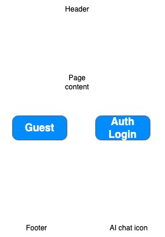
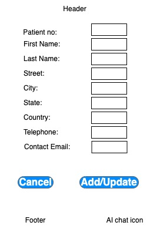
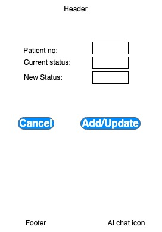
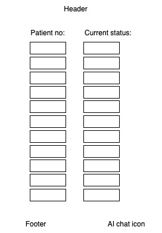
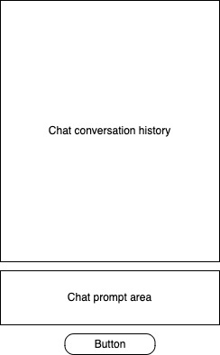

# voyage-project-surgerystatus
Chingu Voyage Project - Surgery Center Status Board

## Table of Contents

* [Overview](#overview)
* [General Instructions](#general-instructions)
* [Requirements & Specifications](#requirements-and-specifications)
* [Acknowledgements](#acknowledgements)
* [About Chingu](#about-chingu)

## Overview

Welcome, Chingus!

It's inevitable that at some point in your life you or a loved one will have to undergo
some type of surgery - either as an inpatient or an outpatient. In this event you or a
companion, depending on who's having the surgery, will be in a hospital waiting room while
the surgery is being performed.

It can be quite stressful on the person in the waiting room. But, this can be lessened by
knowing how the surgery is progressing. Like many other activities there is a workflow
associated with any medical procedure and knowing what state or phase the surgery is in 
will help whoever is waiting to know what's going on.

In this voyage, your team will design and build a web application, _Surgery Status Board_,
that will track a patients progress and display it on a monitor in the waiting room.

Your objective is to create an application that allows surgery center personnel to collect
patient information and track the progress of their surgery. This will be displayed in
the surgical waiting room so loved ones can track patient progress.

An optional goal is to use the free tier of the
[Google Gemini API](https://ai.google.dev/api?lang=node) to implement an interactive AI
agent into the app to allow users to get help information. This means you will need to add 
_context_ about this app in your API calls. You can find simplified example of how to do
this in the `src` directory of this repo.

Surgery Status Board will help you build new _soft skills_ and refine your current role-based skills. It will also let you build new skills and experience using AI.

## General Instructions

This project is designed to be worked on by a team rather than an individual
Chingu. This means you and your team will need to thoroughly read and
understand the requirements and specifications below, **_and_** define and
manage your project following the _Agile Methodology_ defined in the
[Voyage Handbook](https://github.com/chingu-voyages/Handbook/blob/main/docs/guides/voyage/voyage.md#voyage-guide).

As you create this project make sure it meets all of the requirements, but once
you've reached your _Minimum Viable Project (MVP)_ state, start implementing the optional 
features or get creative and extend it in ways we haven't envisioned. In other words, use
the power of teamwork to make it distinctive and unique.

Remember, UI/UX creativity is yours to explore—design an interface that stands
out while ensuring ease of use.

Also, there is no need to purchase any subscriptions or software for this project. The 
[Gemini Flash 1.5 free tier](https://ai.google.dev/pricing#1_5flash) is sufficent for the
AI part of the project and there are many 
[web hosting services](https://github.com/chingu-voyages/Handbook/blob/main/docs/resources/techresources/appdeployment.md) 
with free tiers you can use to deploy your app.

We have added a sample React app to the `src` directory of this repo you can
use to see how to call the Gemini API.

## Requirements and Specifications

### What You Need to Do

The following define the minimum requirements and ideas for features you should
implement. But, we've also included stretch goals you should use to enhance
your app once you complete these basic requirements.

#### Structure

* [ ] This can be implemented as a frontend application for Tier 1 & Tier 3. But, Tier 3 teams should implement both a frontend and backend.
* [ ] You may use any languages, tools, or libraries your team agrees on to design and build this app.
* [ ] You may use AI for research. But, you may **_NOT_** use it to create code for your app.

#### Styling

* [ ] Surprise us!!! Use your team's creativity to make this app distinctive.
* [ ] Add a footer containing a link to your team's GitHub repo.
* [ ] Recommend using this resource for [clean CSS](https://israelmitolu.hashnode.dev/writing-cleaner-css-using-bem-methodology).

#### Functionality

* Application Overview

  * [ ] Develop an application to help surgical center staff track patients and to allow 
  individuals waiting on a patient to see their status.
  * [ ] Ensure the application is user-friendly, accessible, and visually appealing.
  * Each page should contain these components:
    * [ ] A _header_ containing the name of the app, the current date, and navigation options
    * [ ] A _footer_ that links to your GitHub repo and a list of who is on the team.
    * [ ] Optionally, a _chat icon_ that will display a popup when clicked to allow the user to ask for help from the AI agent you build into the app.

    

    But, this wireframe doesn't provide many specifics! That's correct! Your
    task is to design your app from the detailed specifications we provide and
    apply your own styling.

* Navigation options

  * [ ] **Home** - displays the landing page when clicked
  * [ ] **Patient Information** - allows an administrator to add new patient data and start the workflow
  * [ ] **Patient Status Update** - allows a member of the surgical team to update a patients status
  * [ ] **Patient Status** - displays a screen showing the status of all surgical patients

* Screens

  * Home Screen

    

    * [ ] Content that advertises the purpose of the app and it's benefits
    * [ ] A _login form_ users can use to authenticate themselves
    
    There are three distinct user roles your application should authenticate - _Guests_, 
    _Admins_, and _Surgical Team Members_.

    _Guest_ is a generic id used by any generic user. Guests are only allowed to see the Patient 
    Status Display Screen (see below). Guests don't have specific user id's this is the default 
    user type and a login isn't required for it.

    _Admins_ & _Surgical Team Members_ are required to login and be authenticated. _Admins_ 
    should have access to all application functionality. _Surgical Team Members_ may access
    all application functionality, **except** the Patient Information Screen.

    For simplicity your application doesn't need to implement a user registration screen.
    Instead, you may maintain a static (i.e. hard-coded) list of _Admins_ and _Surgical Team
    Members_ to be used by your authentication process.

  * Patient Information Screen

    

    This screen allows authenticated _Admin_ users to add a new patient or update an existing patient data. 

    The data to be collected for each patient includes:
    * [ ] Patient number (see below)
    * [ ] First name
    * [ ] Last name
    * [ ] Street address
    * [ ] City
    * [ ] State, province, or region depending on the surgical centers geographic location
    * [ ] Country
    * [ ] Telephone number
    * [ ] Contact Email address (the address of the person waiting for them)

    When adding a new patient your app should also generate a unique identification for the
    patient - the _patient number_. This must be exactily six characters containing any combination of letters or numbers. It must **NOT** contain any part of the patients nane, address, phone number or any other personal identifying information.

    The starting status to be assigned to new patients is `Checked In`.

    _Admins_ are allowed to update any of this information except the persons patient number.

  * Patient Status Update Screen

    

    This screen allows authenticated _Admins_ or _Surgical Team Members_ to update a patients status. 

    * To update a status
      * [ ] An authenticated user must enter the patient number to display the patients first name, last name, address, city, state, telephone number, and current status
      * [ ] To update the current status the user will use a dropdown to choose from either the prior or the next status
    * [ ] Statuses may not be skipped.
    * [ ] Statuses may be reversed, but only to the prior status.
    * [ ] There is no minimum amount of time between changes in status.

  * Patient Status Display Screen

    

    This screen allows staff as well as individuals in the waiting room to monitor patients'
    progress. 

    Statuses are pre-defined as:

    * **Checked In**: In the facility awaiting their procedure.
    * **Pre-Procedure**: Undergoing surgical preparation.
    * **In-progress**: Surgical procedure is underway.
    * **Closing**: Surgery comnpleted. 
    * **Recovery**: Patient transferred to post-surgery recovery room.
    * **Complete**: Recovery completed. Patient awaiting dismissal.
    * **Dismissal**: Transferred to a hospital room for an overnight stay or for outpatient procedures the patient has left the hospital.

    You can find a sample of how you might encode these as a JSON file in [`src/assets/status.json`](./src/assets/status.json).

    Each status should be assigned a unique color of your choice. 

    This screen should display **only** the following information:

    * [ ] Patient number
    * [ ] Current status. The background color should be the one your team has chosen for each status

    Patients are added to this screen when the addition of their patient information is complete (i.e. `Checked In`) and removed when their status changes to `Dismissed`. 

    The display is updated when a patients status changes. For FE-only apps the update will
    happen when the user presses a `Refresh` button. For full stack apps the update will
    take place when the status is updated in the BE.

    If there are more patients than will fit on a screen it should automatically cycle through 
    the pages, displaying a new page every 20 seconds.

* Optional - Search Input Form in the Patient Information and Patient Status Update screens

  * [ ] The form must include input fields to allow users to search for patients by last name.
  * [ ] The form should include a button to submit the search request.
  * [ ] The form should include a button to clear the contents of the search fields. 
  * [ ] The user must be allowed to update any search fields between submissions.
  
* Search Results Area

  * [ ] When the user clickes the submit button the Search Results Area should be updated with a list of the patients matching the search criteria.
  * [ ] It is valid for the user to enter any combination of search fields or none at all to retrieve all resources.
  * [ ] When the clear button is clicked in the search input form any results from a prior query should be cleared 

* Optional - AI Chat Icon

  * [ ] When clicked, display a popup dialog to allow the user to chat with the AI about this application. This conversation is intended to replace traditional documentation. Instead, it let's the user ask questions like "What tags can I search for?" and "How can I scroll through the results?".
  * [ ] The popup dialog has three components to support this:

      

    - A conversion display area that contains a infinite scroll containing the questions the user asked followed by the response from the AI.
    - An input field where the user may enter their question
    - A button the user may click to submit their question.

    To implement this requirement you'll need to use the
    [Google Gemini API](https://ai.google.dev/api?lang=node) to create a context for your
    application and to allow the users to ask questions using it. You can find and example
    of how to do this in the `src` directory of this repo. 

    This is just an example, for your app you will need to create context information about
    it Google Gemini will use to answer your users questions.

* Validation and Error Handling

  * [ ] Display an error message for invalid inputs (e.g. an undefined tag).
  * [ ] The user must be informed about errors at the time they are detected.
  * [ ] Error messages should be cleared when they are corrected.

* User Interface and Experience (UI/UX)

  * [ ] In general, you will find these [UI design principles](https://www.justinmind.com/ui-design/principles) helpful.
  * [ ] If your team doesn't include a dedicated UI/UX Designer you will [find
these tips](https://github.com/chingu-voyages/Handbook/blob/main/docs/resources/techresources/uiux.md)
helpful.

### Stretch Goals (Not Required)

Once you complete the basic application you may enhance it with any of the
following _optional_ stretch goals. Make sure that any of these you choose
match the capabilities of your tier.

* [ ] Add an AI chatbot users can utilize to get help using the application.
Although this is and optional requirement, we strongly suggest Tier 2 & Tier 3
teams attempt this. 

* [ ] Enhance the search capability by allowing any or all of the following: 
  - Allow the user to specify partial addresses
  - Allow the user to search by telephone number

* [ ] Personalize the application by including the authenticated _Admin_ or _Surgical Team Member's name and in any messages.

* [ ] Implement full-stack application that makes the calls to the Gemini API
via a BE route. Frontend and backend are required.

* [ ] Authenticate users via Google or GitHub OAuth to increase the security of your app.
  * [Github Authentication](https://www.npmjs.com/package/oauth-client-github)
  * [Google Authentication](https://developers.google.com/identity/gsi/web/guides/get-google-api-clientid)
  A detailed guide on how to obtain an API key and perform Google Authentication.

* [ ] Add functionality to email patient status changes to their email address.the results to Check out [EmailJS](https://www.emailjs.com/docs) for how you might email them.

* [ ] Surprise us with any features you would like to add to this app! Brainstorm
with your teammates to see what you can come up with.

## Acceptance Criteria

* [ ] You should include a good readme in your project repo.
* [ ] Add acceptance criteria to your readme for any stretch goals you choose
to implement.
* [ ] Users can enter data into the input form, submit it, and formatted
results will be displayed.
* [ ] Error messages are displayed at the time an error is detected. These
should be clear and provide advice for how to correct the error
* [ ] The UI provides clear feedback for invalid inputs.
* [ ] The UI should be responsive
* [ ] The results returned from Gemini are displayed in a clear and readable
fashion.

## Acknowledgements

We would like to express our profound gratitude to the global developer
community, whose collaborative spirit and shared knowledge continually
motivate and enrich our endeavors. Together, we achieve extraordinary
milestones. Thank you.

## About Chingu

If you aren't yet a member of Chingu we invite you to [join us](https://chingu.io).
We help ourmembers transform what they've learned in courses & tutorials into the
practical experience employers need and want. The experience that helps to set you
apart from other applicants for the same jobs.
